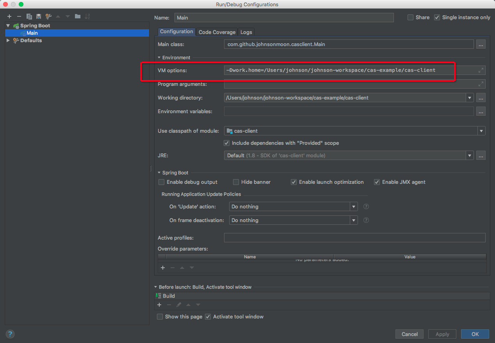
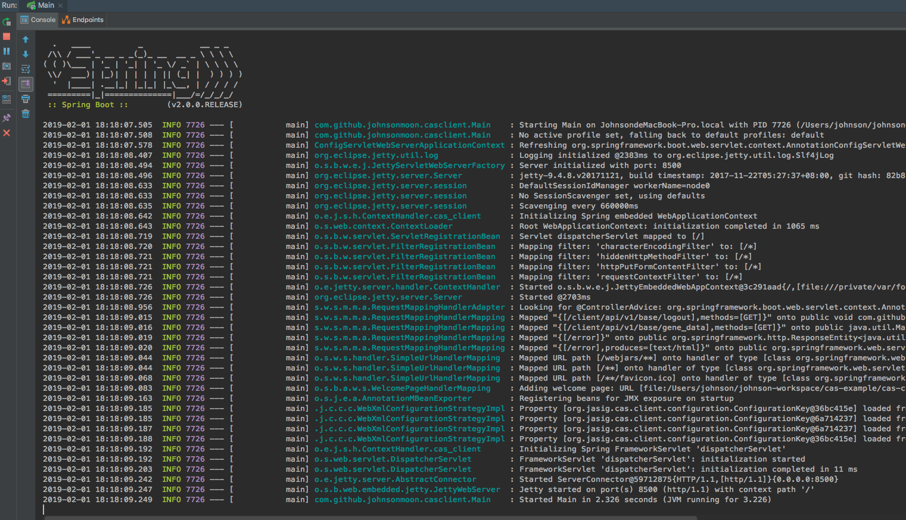
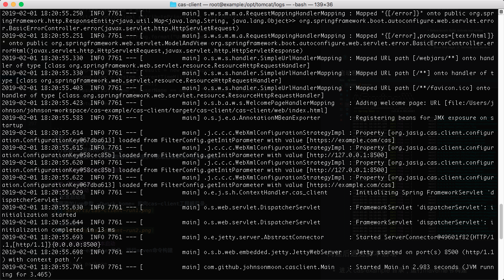
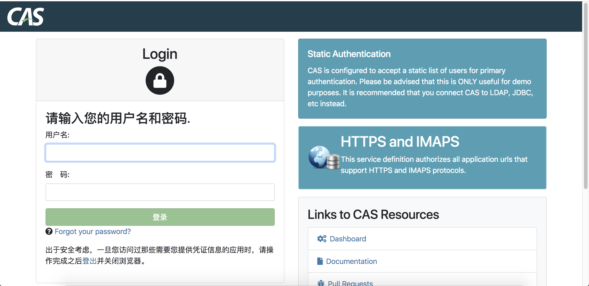
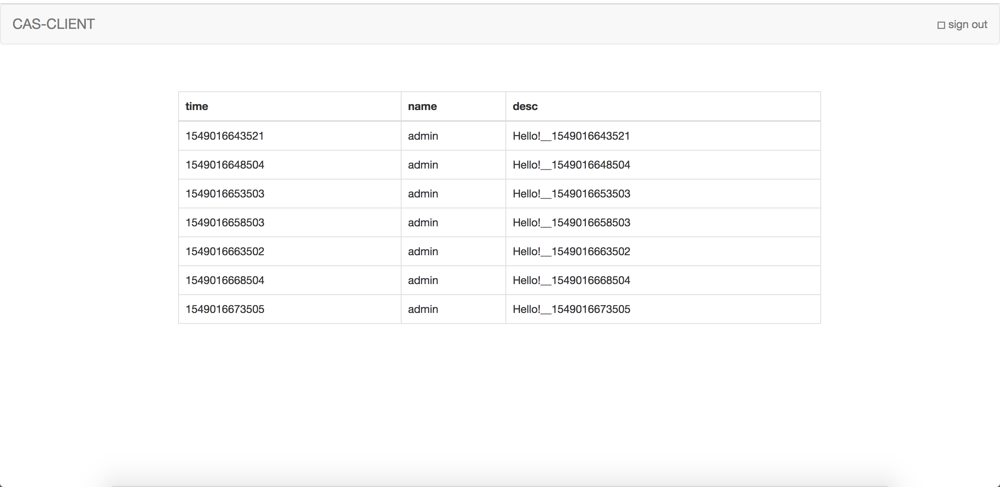

# CAS client
CAS 客户端编写

## 客户端介绍
### 基本架构
cas客户端是一个SpringBoot微应用，引入cas客户端相关依赖，实现请求过滤器，  
从而实现通过CAS单点登录服务器进行用户登录的功能。

### 目录结构
```
|- cas-client
    |- src
        |- main
            |- bin
                |- startup.sh   启动脚本
            |- java             Java源代码
            |- resources        Java配置资源文件
    |- web                      前端文件
    |- assembly.xml             工程打包配置文件
    |- pom.xml                  工程配置文件
```

## 引入依赖
```
<dependency>
    <groupId>org.springframework.boot</groupId>
    <artifactId>spring-boot-starter-web</artifactId>
    <version>2.0.0.RELEASE</version>
    <exclusions>
        <exclusion>
            <groupId>org.springframework.boot</groupId>
            <artifactId>spring-boot-starter-tomcat</artifactId>
        </exclusion>
    </exclusions>
</dependency>
<dependency>
    <groupId>org.springframework.boot</groupId>
    <artifactId>spring-boot-starter-jetty</artifactId>
    <version>2.0.0.RELEASE</version>
</dependency>
<dependency>
    <groupId>org.jasig.cas.client</groupId>
    <artifactId>cas-client-core</artifactId>
    <version>3.4.1</version>
</dependency>
<dependency>
    <groupId>org.slf4j</groupId>
    <artifactId>slf4j-simple</artifactId>
    <version>1.7.1</version>
</dependency>
```

## 编写代码

### 启动代码  
**com.github.johnsonmoon.casclient.Main**
```
package com.github.johnsonmoon.casclient;

import com.github.johnsonmoon.casclient.filter.CASAuthFilter;
import org.springframework.boot.SpringApplication;
import org.springframework.boot.autoconfigure.SpringBootApplication;
import org.springframework.boot.web.servlet.ServletComponentScan;
import org.springframework.boot.web.servlet.ServletContextInitializer;

import javax.servlet.DispatcherType;
import javax.servlet.FilterRegistration;
import javax.servlet.ServletContext;
import javax.servlet.ServletException;
import java.util.EnumSet;

/**
 * Create by johnsonmoon at 2019/1/30 09:24.
 */
@ServletComponentScan
@SpringBootApplication
public class Main implements ServletContextInitializer {
    //TODO modified
    public static final String serverName = "http://127.0.0.1:8500";
    public static final String casServerLoginUrl = "https://example.com/cas/login";
    public static final String casServerUrlPrefix = "https://example.com/cas";
    public static final String casLogoutUrl = "https://example.com/cas/logout";

    public static void main(String... args) {
        SpringApplication.run(Main.class, args);
    }

    @Override
    public void onStartup(ServletContext servletContext) throws ServletException {

        // 用于单点退出
        servletContext.addListener(org.jasig.cas.client.session.SingleSignOutHttpSessionListener.class.getName());

        FilterRegistration.Dynamic CASSignOutFilter = servletContext.addFilter("CASSignOutFilter", org.jasig.cas.client.session.SingleSignOutFilter.class.getName());
        CASSignOutFilter.setInitParameter("casServerUrlPrefix", casServerUrlPrefix);
        CASSignOutFilter.addMappingForUrlPatterns(EnumSet.of(DispatcherType.REQUEST), false, "/*");

        // 该过滤器负责用户的认证工作，必须启用它，因业务需求，重新实现CasAuthFilter
        FilterRegistration.Dynamic CASFilter = servletContext.addFilter("CASFilter", CASAuthFilter.class.getName());
        CASFilter.setInitParameter("casServerLoginUrl", casServerLoginUrl);
        CASFilter.setInitParameter("serverName", serverName);
        CASFilter.addMappingForUrlPatterns(EnumSet.of(DispatcherType.REQUEST), false, "/*");

        // 该过滤器负责对Ticket的校验工作，必须启用它
        FilterRegistration.Dynamic CASValiFilter = servletContext.addFilter("CASValiFilter", org.jasig.cas.client.validation.Cas20ProxyReceivingTicketValidationFilter.class.getName());
        CASValiFilter.setInitParameter("casServerUrlPrefix", casServerUrlPrefix);
        CASValiFilter.setInitParameter("serverName", serverName);
        CASValiFilter.addMappingForUrlPatterns(EnumSet.of(DispatcherType.REQUEST), false, "/*");

        /*
         *   该过滤器负责实现HttpServletRequest请求的包裹，比如允许开发者通过HttpServletRequest的getRemoteUser()方法获得SSO登录用户的登录名，可选配置。
         */
        FilterRegistration.Dynamic CASWrapperFilter = servletContext.addFilter("CASWrapperFilter", org.jasig.cas.client.util.HttpServletRequestWrapperFilter.class.getName());
        CASWrapperFilter.addMappingForUrlPatterns(EnumSet.of(DispatcherType.REQUEST), false, "/*");
    }
}

```

注意：  
- 由于客户端工程为SpringBoot应用，因此通过实现 **ServletContextInitializer** 接口的 **onStartup** 方法，注册cas客户端需要的各个组件其中包括必要的监听器、web过滤器等，以及需要开发者自己实现的一个过滤器。  
- 启动代码的几个常亮配置是必须的，配置了CAS服务端的URL等， **serverName**, **casServerLoginUrl**, **casServerUrlPrefix**, **casLogoutUrl**

### 启动配置文件
```
spring:
  application:
    name: cas-client
  resources:
    static-locations: file:${work.home}/web/

server:
  port: 8500
  servlet:
    context-path: /
    application-display-name: cas-client
  tomcat:
    max-threads: 200
    uri-encoding: UTF-8

logging:
  file: ${user.dir}/logs/cas-client.log
```
说明：  
配置了客户端启动的端口、前端资源路径等


### 自定义过滤器  
**com.github.johnsonmoon.casclient.filter.CASAuthFilter**  
```
package com.github.johnsonmoon.casclient.filter;

import com.github.johnsonmoon.casclient.Main;
import org.jasig.cas.client.Protocol;
import org.jasig.cas.client.util.AbstractCasFilter;
import org.jasig.cas.client.util.CommonUtils;
import org.jasig.cas.client.validation.Assertion;
import org.slf4j.Logger;
import org.slf4j.LoggerFactory;

import javax.servlet.*;
import javax.servlet.http.HttpServletRequest;
import javax.servlet.http.HttpServletResponse;
import javax.servlet.http.HttpSession;
import java.io.IOException;

/**
 * Create by johnsonmoon at 2019/1/30 09:48.
 */
public class CASAuthFilter extends AbstractCasFilter {
    private static Logger logger = LoggerFactory.getLogger(CASAuthFilter.class);

    @Override
    public void doFilter(ServletRequest servletRequest, ServletResponse servletResponse, FilterChain filterChain) throws IOException, ServletException {
        final HttpServletRequest request = (HttpServletRequest) servletRequest;
        final HttpServletResponse response = (HttpServletResponse) servletResponse;

        final HttpSession session = request.getSession(false);
        final Assertion assertion = session != null ? (Assertion) session.getAttribute(CONST_CAS_ASSERTION) : null;


        /**
         * TODO
         * Check whether there has already been a user session of this request.
         * If there has been, then pass the request to other filters in {@code FilterChain}
         */
        if (assertion != null) {
            filterChain.doFilter(request, response);
            return;
        }

        /**
         * TODO
         * If there is no user session, while the request contains a {@code ticket} parameter,
         * it means that a user has already loggedIn in the CAS-Server, redirect back to our application,
         * then pass the request to other filters in {@code FilterChain}, in order to verify
         * the ticket or so.
         */
        final String ticket = retrieveTicketFromRequest(request);
        if (CommonUtils.isNotBlank(ticket)) {
            filterChain.doFilter(request, response);
            return;
        }

        /**
         * TODO
         * If there is no user session, then get the redirectUrl ready,
         * and redirect the request to CAS-Server login page.
         */
        final String serviceUrl = constructServiceUrl(request, response);
        logger.info("Service url: {}", serviceUrl);
        final String redirectUrl = CommonUtils.constructRedirectUrl(
                Main.casServerLoginUrl,
                getProtocol().getServiceParameterName(),
                serviceUrl, false, false);

        logger.info("Redirecting to: \"{}\"", redirectUrl);
        response.sendRedirect(redirectUrl);
    }

    public CASAuthFilter(Protocol protocol) {
        super(protocol);
    }

    public CASAuthFilter() {
        this(Protocol.CAS2);
    }
}

```
注意：  
自定义过滤器中，需要开发者实现逻辑为：  
(1)判断请求是否带有有效的用户会话，若有，则说明用户成功登陆CAS服务器，对该请求放行。
(2)若请求中午有效的用户会话，而有带有票据参数(ticket)，则将请求放行给其他过滤器进行校验等一系列操作。
(3)若请求中既没有有效的用户会话，也没有票据参数，则将请求重定向到CAS服务器用户登录页面。

### 基础服务Controller
**com.github.johnsonmoon.casclient.controller.BaseController**  
```
package com.github.johnsonmoon.casclient.controller;

import com.github.johnsonmoon.casclient.Main;
import org.jasig.cas.client.authentication.AttributePrincipal;
import org.slf4j.Logger;
import org.slf4j.LoggerFactory;
import org.springframework.web.bind.annotation.GetMapping;
import org.springframework.web.bind.annotation.RequestMapping;
import org.springframework.web.bind.annotation.RestController;

import javax.servlet.http.HttpServletRequest;
import javax.servlet.http.HttpServletResponse;
import java.util.HashMap;
import java.util.Map;

/**
 * Create by johnsonmoon at 2019/1/30 10:19.
 */
@RestController
@RequestMapping("/client/api/v1/base")
public class BaseController {
    private static Logger logger = LoggerFactory.getLogger(BaseController.class);

    @GetMapping("/logout")
    public void logout(HttpServletResponse response) {
        String casLogoutUrl = Main.casLogoutUrl;
        try {
            if (response != null) {
                response.sendRedirect(casLogoutUrl);
            }
        } catch (Exception e) {
            logger.warn(e.getMessage(), e);
        }
    }

    @GetMapping("/gene_data")
    public Map<String, Object> generateData(HttpServletRequest request) {
        /**
         * TODO get loggedIn user information
         */
        String userName = null;
        AttributePrincipal attributePrincipal = (AttributePrincipal) request.getUserPrincipal();
        if (attributePrincipal != null) {
            userName = attributePrincipal.getName();
            logger.info(String.format("User name: [%s]", userName));
            //Map<String, Object> map =  attributePrincipal.getAttributes();
        }


        Map<String, Object> result = new HashMap<>();
        long time = System.currentTimeMillis();
        result.put("time", time);
        result.put("name", (userName == null ? "johnson_" : userName));
        result.put("desc", "Hello!__" + time);
        return result;
    }
}

```
说明：  
该类提供了两个前端接口：  
(1)获取CAS服务用户登出URL
(2)获取数据接口，获取的数据包含从请求中获取已登录用户信息的数据。

## 启动客户端并检验单点登录

### 启动客户端
#### IDE启动
- 配置启动项  
需要添加jvm参数 -Dwork.home= 指向cas-client工程根目录。  
  

- 启动程序  
  

#### 构建后通过脚本启动
- 进入 cas-example 目录，运行maven命令构建
```
mvn clean package
```  

- 构建完成，进入 cas-client/target/cas-client/cas-client/ 目录，运行启动脚本  
```
./startup.sh
```  
  

### 检验单点登录
- 登录客户端首页 **http://127.0.0.1:8500**  
页面自动跳转至CAS登录页，如下：  
  

- 输入用户名密码点击登录，页面自动跳转回客户端，客户端定时获取用户数据(用户名)输出到页面中，如下：  

