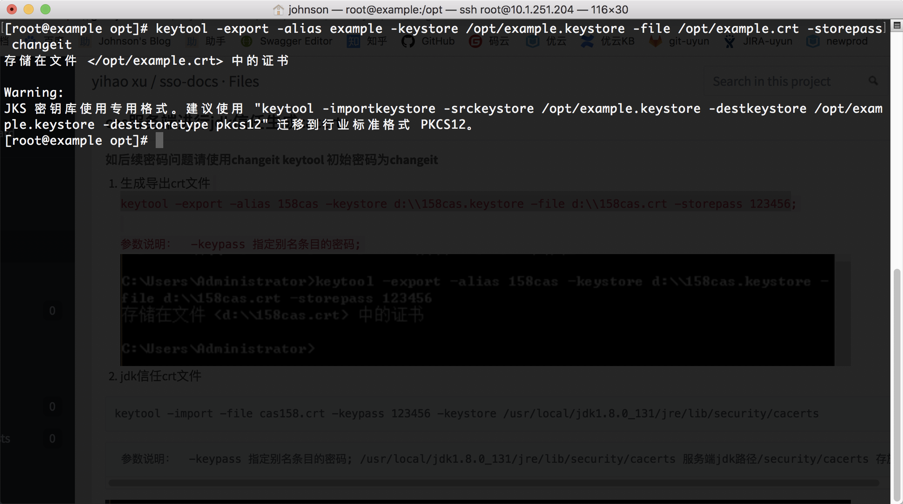
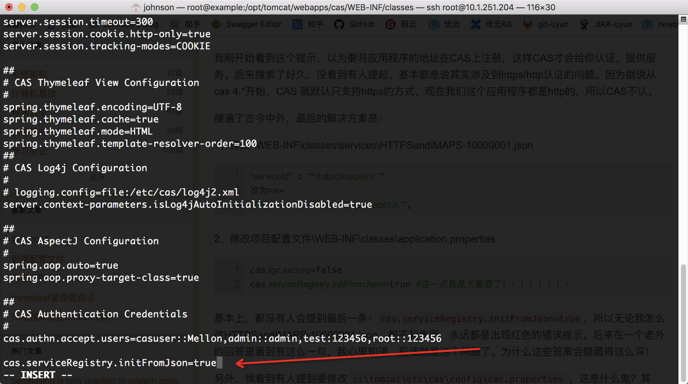

# CAS server
CAS 单点登录服务器搭建

## 分步骤说明
### 下载CAS服务器源码并打包war文件
[编译源码仓库地址](https://github.com/apereo/cas-overlay-template)  

这里下载了支持**java8**以及**maven**构建工具的的**5.3**版本
```
cas-overlay-template-5.3.zip
```
将其解压到本地，进入目录运行
```
./build.sh package
```
即可进行源码构建打包，如下图所示：  


等待打包完成，最后可以在 **target** 目录下找到 cas.war 包:  


### CAS服务器准备
#### 域名配置
- 进入准备安装CAS单点登录服务端的服务器  

- 配置CAS服务器的域名  
这里介绍在 **centos** 下，修改 /etc/hosts 文件，将本机IP地址绑定至**[example.com]**  
  
保存修改，并重启服务器使之生效

#### client访问端hosts配置
- 对需要连接CAS服务器的CAS客户端运行的机器，配置CAS服务器的访问域名表  
这里需要运行客户端程序访问CAS服务器的机器是mac电脑，修改 /etc/hosts 文件在其底部添加一行即可，如下：  
  

- 验证一下，需要运行客户端程序访问CAS服务器的机器通过 ping 能否访问该域名  
  
能够ping通即说明配置成功。

#### 安装Java8运行环境
- 安装jdk  
  
- 配置Java环境变量  
  
- 使用 **java -version** 验证  
  

### 对配置的域名导出网站证书
**导出文件均在 /opt 目录下进行，输出目录均为 /opt **  

- 导出keystore
```
keytool -genkeypair -alias example -keyalg RSA -storepass changeit -keystore example.keystore

参数说明： -genkey 生成秘钥对 -alias 别名 -keyalg 加密算法 -storepass 密码 -keystore 指定密钥库的名称(产生的各类信息将不在.keystore文件中
```
  

- 根据keystore生成cer文件
```
keytool -export -alias example -storepass changeit -file example.cer -keystore example.keystore

参数说明： -export 导出 -alias 别名 -storepass 指定密钥库的密码 -file  生成cer文件名.cer -keystore 指定密钥库的名称(产生的各类信息将不在.keystore文件中
```
  

- 生成导出crt文件  
```
keytool -export -alias example -keystore /opt/example.keystore -file /opt/example.crt -storepass changeit

```


- CAS服务器的 jdk 添加信任
```
keytool -import -file example.crt -keypass changeit -keystore /opt/jdk/jre/lib/security/cacerts

参数说明：  -keypass 指定别名条目的密码; /opt/jdk/jre/lib/security/cacerts 服务端jdk路径/security/cacerts 存放文件路径
```


- 客户端(需要运行客户端程序访问CAS服务器的机器)的 jdk 添加信任  
(1)通过 ftp工具 或 scp命令，将 服务端刚才生成的 /opt/example.cer 文件拷贝至客户端机器中    
(2)客户端 jdk 添加信任
```
keytool -importcert -alias example -file example.cer -keystore "$JAVA_HOME/jre/lib/security/cacerts" -storepass changeit

参数说明：  "$JAVA_HOME/jre/lib/security/cacerts" 客户端jdk路径/security/cacerts 存放文件路径
```


### CAS服务端安装  
#### 安装Tomcat  
这里安装支持Java8的Tomcat8，上传包至CAS服务器并解压，这里对解压目录进行重命名为tomcat
```
tar -xzf apache-tomcat-8.5.37.tar.gz

mv apache-tomcat-8.5.37 tomcat
```

#### 配置Tomcat ssl证书信息
这里对tomcat使用的ssl连接进行证书配置，配置的证书即上文在CAS服务器上生成的证书  
修改 /opt/tomcat/conf/server.xml 配置文件，添加以下配置:
```
<Connector port="443" protocol="org.apache.coyote.http11.Http11NioProtocol" SSLEnabled="true"
               maxThreads="150" scheme="https" secure="true"
               clientAuth="false" sslProtocol="TLS"
                keystoreFile="/opt/example.keystore"
                keystorePass="changeit"
                truststoreFile="/opt/jdk/jre/lib/security/cacerts"/>
```

### CAS Server 安装
#### 将打包好的 cas.war 包上传拷贝至 /opt/tomcat/webapps/ 目录下，重启tomcat
```
/opt/tomcat/bin/shutdown.sh
/opt/tomcat/bin/startup.sh
```

#### 待tomcat启动并部署完毕cas-server后，在客户端浏览器输入地址进行访问  

地址： **https://example.com/cas** 访问页面如下：  


#### 再次关闭tomcat，进入cas-server目录进行细节配置
-  配置若干登录用户信息  
在这里通过cas-server自带的配置文件，静态的写入若干登录用户信息，以供客户端登录使用  
(1)进入目录 **/opt/tomcat/webapps/cas/WEB-INF/classes**, 找到配置文件 **application.properties** 和 **user-details.properties**
(2)编辑 **application.properties** 文件，如下：  
  
(3)编辑 **user-details.properties** 文件，如下：  
  

- 配置客户端serviceUrl允许http访问
(1)进入目录 **/opt/tomcat/webapps/cas/WEB-INF/classes/services**, 编辑 **HTTPSandIMAPS-10000001.json** 文件，如下图：  
  
(2)进入目录 **/opt/tomcat/webapps/cas/WEB-INF/classes**，编辑 **application.properties** 文件，添加 **cas.serviceRegistry.initFromJson=true** 配置如下：  


#### 启动tomcat并验证
- 进入登录页输入用户名密码点击登录，登陆成功则说明上述配置成功，如下图：  

